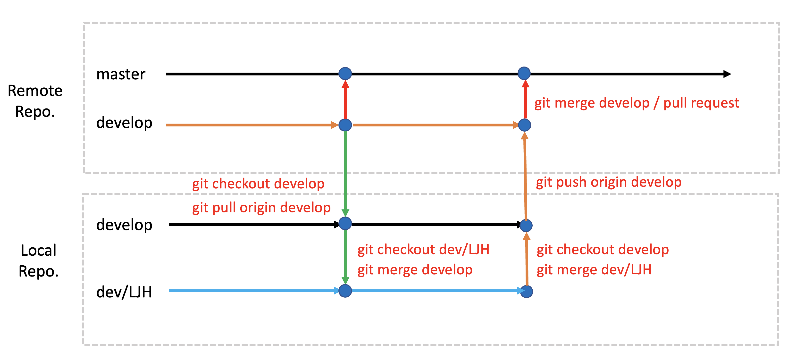

# 프로젝트 기반 VR 콘텐츠 개발과정 - 12기

## 기획 발표문서

[발표 문서 업로드](https://drive.google.com/drive/folders/1fFwbWNDJ8QJoe2Db2GLpjP1PG9XFGkZQ?usp=sharing)

## 기획 팀 빌딩

- 팀별 자리 배치
- 선정된 기획에 대해 브레인 스토밍
- 대략적인 구현 기능 목록 정리

| NO  | 팀명                | 프로젝트명                         | 플랫폼 | 팀장   | 팀원                           | 트렐로                                                     | 멘토           |
| --- | ------------------- | ---------------------------------- | ------ | ------ | ------------------------------ | ---------------------------------------------------------- | -------------- |
| 1   | Guest               | Checkout                           | VR     | 서현지 | 서현지, 길재환, 이주영         | [링크](https://trello.com/b/yKjYmj4C/project)              | 스코넥         |
| 2   | Curving Point       | Tuning                             | VR     | 김석우 | 장세림, 김석우, 김민지         | [링크](https://trello.com/b/JaUhdPFq/teammanagementboard)  | 로보웍스       |
| 3   | Q-Brain             | CubiIsland 1 <br>- 굴러오는 사고력 | AR     | 이재민 | 이재민,이유나, 추성결          | [링크](https://trello.com/b/krNboHzW/q-brain)              | 글로브포인트   |
| 4   | Signiture           | HandMade                           | VR     | 이주성 | 이주성, 이유성, 장민욱, 권영진 | [링크](https://trello.com/b/IxFITtmL/handmade)             | 이노시뮬레이션 |
| 5   | MoaMoa              | Gradational Maze                   | VR     | 김승환 | 김승환, 홍지원, 신하은, 이건   | [링크](https://trello.com/b/7AlYfnOH/vrfinalmoamoa)        | 플레이스비     |
| 6   | Tears of the medici | Tears of the medici                | VR     | 구관우 | 구관우, 강태훈, 현민기, 강효준 | [링크](https://trello.com/b/c7CLErgg/tears-of-the-medichi) | 팀엔터테인먼트 |
| 7   | 미정                | 미정                               | VR     | 김영서 | 김영서                         |                                                            | 개인 멘토      |


## 기획 산출물

- 기획서(최종)
- 시스템 구성도(Flow)
- 스토리보드
- UI 구성도
- 상세 기능 목록(엑셀, 구글 시트)

### 프로젝트 일정

| 일정              | 기간                                   |
| :---------------- | :------------------------------------- |
| **개발 기간**     | 06/02 ~ 07/28                          |
| **중간 점검**     | 06/30                                  |
| **발표 문서작성** | 07/19 ~                                |
| **발표 리허설**   | 07/27 (09:00 ~)                        |
| **시연 및 발표**  | 07/28 (12:30부터 시연, 2:30 부터 발표) |

- 프로젝트의 목적
  - 교육기간동안 습득한 VR,AR 기술을 종합적으로 사용한 최종 프로젝트로서 전반적인 개발 과정을 이해하고 다양한 시행착오를 통해 개개인의 개발 역량을 강화한다.
  - 협업을 통해 각각의 역할을 이해하고 개발자간의 연계 작업에 대한 능력을 향상 시킨다.

- 구현 주제

  - 콘텐츠의 내용 및 주제는 제한이 없으며 VR,AR 관련된 콘텐츠를 개발한다.
  - 구현 형태는 체험 또는 게임의 형태이여도 관계없음.
  - 개발할 콘텐츠의 주제 선정시 대상 연령층을 명확히 한다. (예: 성인, 청소년, 아동, ...)
  - 구현 디바이스(Vive, Quest)의 한계를 명확히 인지하고 콘텐츠의 리소스 및 전체적인 분위기(테마)를 선정한다.

- 팀 구성 및 팀장의 역할
  - 기본 3인 1팀으로 구성한다. (특별한 경우 4인 1팀까지도 허용)
  - 팀장은 반드시 팀원들의 동의를 거쳐 선정한다.
  - 팀장과 팀원은 수직적인 관계가 아니며 수평적인 관계임을 명심한다.
  - 팀장은 프로젝트의 전체 일정과 팀원의 업무 분담등 전체적인 프로젝트 관리의 책임을 진다.
  - 팀장은 수시로 프로젝트의 진행상황에 대해 지도강사와 소통한다.
  - 팀장은 팀원의 작업물에 대한 정기적인 통합(Merge)와 프로젝트 전체 백업을 진행한다.(최소 주 1회 이상)
  - 하원시 커밋 & 푸시, 등원시 풀(pull)한 후 작업 진행을 원칙
  - 팀원은 로컬HDD에 개별 백업을 매일 진행한다.(선택사항)

- 협업 및 형상관리
  - 일정관리는 **Trello** 또는 **Notion**을 활용하며 모니터링을 위해 지도 강사(myleje@gmail.com)를 반드시 초대한다. [(트렐로 trello.com)](https://trello.com) 
  - 협업 메신저을 사용할 경우 슬렉([Slack](https://slack.com/intl/en-kr/))로 팀 내부적으로 사용하는 것도 권장.
  - 형상관리는 깃허브(Github)를 사용한다. (Unity 콜라보레이트도 괜찮으나 깃과 깃허브를 권장)
  - GitHub GUI 툴은 **[SourceTree](https://www.sourcetreeapp.com)**, [GitHub Desktop](https://desktop.github.com),   [GitKraken](https://www.gitkraken.com) 중 하나를 선택한다. (SourceTree 권장함.)
  - SourceTree는 팀원간의 깃 사용이 능숙해지는 중간 평가후 사용한다.(선택사항) 그전까지는 CLI(Command Line Interface)에서 명령어를 통해 작업한다.
  - 깃허브 사용시 개발자별 브랜치를 생성한다. 개발자 브랜치의 네이밍을 다음과 같이 **dev/영문이니셜** 방식을 추천.
    ```
    dev/LJH
    dev/PJW
    ```
  - 개발 브랜치(develop)를 운영할 것인지를 결정
  - 깃허브 사용시 다양한 충돌(conflict)를 경험하게될 것이며 이를 방지하거나 해결하는 경험을 쌓는다.
  - 팀장은 매일 팀원들의 소스 코드의 수동 백업 여부를 확인 및 관리한다.

- 구현 기기
  - HMD 장비 : Vive, Oculus Quest (택일)
  - 어트렉션  : Sym4D (선택사항)
  - 네트워크 기능 (선택사항)

<!-- ### 팀 미팅

- 깃허브 리포지토리 Owner 선정
- 깃허브 리포지토리 생성
- 팀원 업무 분장 (대략적인 업무)
- 프로젝트 세부 기획 (브레인 스토밍 - 트렐로, 노션에 작성) -->

### 프로젝트 표준안 정립

- 프로젝트 뷰의 폴더명 규약
- 함수(메소드) 명명 규칙 (Pascal Case)
- 변수 명명 규칙 (Camel Case)
- 로컬 백업 방식 및 주기 결정

### 프로젝트 설계

1. 전체 흐름도(App Flow, Story Board)
2. Screen Design (ppt)
3. UI Design (ppt)
4. 기능 명세서 (excel)

---
## ML-Agents 설정

#### Python 3.8.13 버전 설치
아래 사이트에 접속한 후 3.8.13 버전 설치 파일 다운로드 후 설치 (3.9.16 버전도 성공함)

https://github.com/adang1345/PythonWindows

#### 파이토치 1.7.1 설치
터미널에서 다음 명령어를 통해 설치

```sh
pip3 install torch~=1.7.1 -f https://download.pytorch.org/whl/torch_stable.html
```

#### ML-Agents 파일 클론

```sh
git clone --branch release_20 https://github.com/Unity-Technologies/ml-agents.git
```

#### 파이썬 패키지 설치
설치 후 터미널에서 ml-agents 폴더안으로 이동한 후 다음 명령어를 차래대로 실행

```sh
pip3 install -e ml-agents-envs
pip3 install -e ml-agents
```

#### Google Protocal Buffer 다운그레이드

protobuf 패키지를 삭제한 후 3.20.* 버전을 설치한다.

```sh
pip3 uninstall protobuf
pip3 install protobuf==3.20.*
```
---

### 깃 브랜치 전략
### Git Flow



- 작업 시작하기 전 깃 작업

```shell
# 로컬 조장소가 develop 브랜치인지 확인
git branch

# 만약 develop 브랜치가 아닌경우 develop 브랜치로 체크아웃
git checkout develop

# 원격 저장소의 develop 브랜치에서 가져오기(Pull)
git pull origin develop

# 충돌(Conflict)가 발생한 경우 해결한 후 Merge Commit 한다.
git add .
git commit -m "충돌해결 - 내용"

# 정상적으로 pull이 완료된 후 자신의 개발 브랜치로 체크아웃
git checkout dev/LJH

# 로컬 develop 저장소의 변경사항을 자신의 개발 브랜치로 Merge 한다.
git merge develop

# 충돌(Conflict)가 발생한 경우 해결한 후 Merge Commit 한다.
git add .
git commit -m "충돌해결 - 내용"

# 정상적으로 병합이 완료된 후 작업을 진행한다.

```

- 작업 종료 후 깃 작업

```shell
# 자신의 개발 브랜치의 작업내용을 모두 커밋한다.
git add .
git commit -m "작업 내용"

# 로컬 develop 브랜치로 체크아웃한다.
git checkout develop

# 자신의 개발 브랜치의 내용을 로컬 develop 브랜치로 병합(merge) 한다.
git merge dev/LJH

# 충돌(Conflict)가 발생한 경우 해결한 후 Merge Commit 한다.
git add .
git commit -m "충돌해결 - 내용"

# 충돌을 해결하거나 정상적으로 병합이 완료된 경우 원격 develop 브랜치로 push 한다.
git push origin develop

# 만약 원격 리포지토리에 변경 사항이 있을 경우 먼저 Pull 한 후 Push 한다.
```


## 터레인 및 라이트맵 깨지는 현상 방지

- .gitattributes 파일에 다음 라인 추가
- 유니티에서 터레인과 라이트맵 파일은 2진 파일로 생성

``` 
	*Terrain*.asset binary
	*Lightmap*.asset binary
```

## 현업 멘토링

| 업체명         | 업종       | 홈페이지            | 멘토 담당자     | 이메일                  | 멘티 팀명          |
| -------------- | ---------- | ------------------- | --------------- | ----------------------- | ------------------ |
| 팀엔터테인먼트 | 게임       | www.timent.co.kr    | 김석겸 팀장     | yourang@timent.co.kr    | Tear of the Medici |
| 글로브포인트   | 교육       | www.vrware.co.kr    | 이용일 실장     | yi.lee@globepoint.co.kr | Q-Brain            |
| 이노시뮬레이션 | 시뮬레이션 | www.innosim.com     | 이지선 이사     | jslee@innosim.com       | Signiture          |
| 스코넥         | 게임       | www.skonec.com      | 노충현 프로듀서 | chnoh@skonec.com        | Guest              |
| 플레이스비     | 콘텐츠     | www.placeb.com      | 장상규 이사     |                         | MoaMoa             |
| 로보웍스       | VR 콘텐츠  | www.roboworks.co.kr | 이현종 대표     | sbono@naver.com         | Curving Point      |
| 개인 멘토      | -          | -                   | 이광호          |                         | 김영서             |

### 멘토일 일정
 - 주 1회 2시간 (요일과 시간은 멘토와 협의해 변경가능)
 - 멘토링 장소 (추후 공지, 빈 강의장 섭외 예정)
 - 멘토링 방식 (줌 연결, 오프라인)
 - 줌 계정은 추후 전달 예정
 - 금일(6월 20일) 멘토 담장자에게 팀장이 인사 메일 보내기 (팀과 팀원 소개 및 상견례)
  